# ndx-fiber-photometry Extension for NWB

This is an NWB extension for storing fiber photometry recordings and associated metadata.
It replaces the deprecated [ndx-photometry](https://github.com/catalystneuro/ndx-photometry) extension.

This extension consists of 11 new neurodata types:
- `Indicator` extends `Device` to hold metadata on the fluorescent indicator (ex. label=GCaMP6).
- `OpticalFiber` extends `Device` to hold metadata on the optical fiber (ex. numerical_aperture=0.39).
- `ExcitationSource` extends `Device` to hold metadata on the excitation source (ex. excitation_wavelength_in_nm=470.0).
- `Photodetector` extends `Device` to hold metadata on the photodetector (ex. detected_wavelength_in_nm=520.0).
- `DichroicMirror` extends `Device` to hold metadata on the dichroic mirror (ex. cut_on_wavelength_in_nm=470.0).
- `BandOpticalFilter` extends `Device` to hold metadata on any bandpass or bandstop optical filters (ex. center_wavelength_in_nm=505.0).
- `EdgeOpticalFilter` extends `Device` to hold metadata on any edge optical filters (ex. cut_wavelength_in_nm=585.0).
- `FiberPhotometryResponseSeries` extends `TimeSeries` to hold the recorded fiber photometry responses.
- `CommandedVoltageSeries` extends `TimeSeries` to hold the commanded voltage values for a single fiber photometry trace.
- `FiberPhotometryTable` extends `DynamicTable` to hold information on the fiber photometry setup.
    Each row of the table reference a combination of the devices and a commanded voltage series that correspond to a single fiber photometry trace.
- `FiberPhotometry` extends `LabMetaData` to hold the `FiberPhotometryTable`.

## Installation

To install the latest stable release through PyPI,
```bash
pip install ndx-fiber-photometry
```

## Usage

```python
import datetime
import numpy as np
from pynwb import NWBFile, NWBHDF5IO
from ndx_fiber_photometry import (
    Indicator,
    OpticalFiber,
    ExcitationSource,
    Photodetector,
    DichroicMirror,
    BandOpticalFilter,
    EdgeOpticalFilter,
    FiberPhotometry,
    FiberPhotometryTable,
    FiberPhotometryResponseSeries,
    CommandedVoltageSeries,
)

nwbfile = NWBFile(
    session_description='session_description',
    identifier='identifier',
    session_start_time=datetime.datetime.now(datetime.timezone.utc)
)

indicator_green = Indicator(
    name="indicator_1",
    description="Green indicator",
    label="GCamp6f",
    injection_location="VTA",
    injection_coordinates_in_mm=(3.0, 2.0, 1.0),
)
indicator_red = Indicator(
    name="indicator_2",
    description="Red indicator",
    label="Tdtomato",
    injection_location="VTA",
    injection_coordinates_in_mm=(3.0, 2.0, 1.0),
)

optical_fiber_1 = OpticalFiber(
    name="optical_fiber_1",
    model="fiber_model",
    numerical_aperture=0.2,
    core_diameter_in_um=400.0,
)
optical_fiber_2 = OpticalFiber(
    name="optical_fiber_2",
    model="fiber_model",
    numerical_aperture=0.2,
    core_diameter_in_um=400.0,
)

excitation_source_1 = ExcitationSource(
    name="excitation_source_1",
    description="excitation sources for green indicator",
    model="laser model",
    illumination_type="laser",
    excitation_wavelength_in_nm=470.0,
)
excitation_source_2 = ExcitationSource(
    name="excitation_source_2",
    description="excitation sources for red indicator",
    model="laser model",
    illumination_type="laser",
    excitation_wavelength_in_nm=525.0,
)

photodetector_1 = Photodetector(
    name="photodetector_1",
    description="photodetector for green emission",
    detector_type="PMT",
    detected_wavelength_in_nm=520.0,
    gain=100.0,
)
photodetector_2 = Photodetector(
    name="photodetector_2",
    description="photodetector for red emission",
    detector_type="PMT",
    detected_wavelength_in_nm=585.0,
    gain=100.0,
)

dichroic_mirror_1 = DichroicMirror(
    name="dichroic_mirror_1",
    description="Dichroic mirror for green indicator",
    model="dicdichroic mirror model",
    cut_on_wavelength_in_nm=470.0,
    transmission_band_in_nm=(460.0, 480.0),
    cut_off_wavelength_in_nm=500.0,
    reflection_band_in_nm=(490.0, 520.0),
    angle_of_incidence_in_degrees=45.0,
)

dichroic_mirror_2 = DichroicMirror(
    name="dichroic_mirror_2",
    description="Dichroic mirror for red indicator",
    model="dicdichroic mirror model",
    cut_on_wavelength_in_nm=525.0,
    transmission_band_in_nm=(515.0, 535.0),
    cut_off_wavelength_in_nm=585.0,
    reflection_band_in_nm=(575.0, 595.0),
    angle_of_incidence_in_degrees=45.0,
)

band_optical_filter = BandOpticalFilter(
    name="band_optical_filter",
    description="emission filter for green indicator",
    model="emission filter model",
    center_wavelength_in_nm=505.0,
    bandwidth_in_nm=30.0, # 505±15nm
    filter_type="Bandpass",
)
edge_optical_filter = EdgeOpticalFilter(
    name="edge_optical_filter",
    description="emission filter for red indicator",
    model="emission filter model",
    cut_wavelength_in_nm=585.0,
    slope_in_percent_cut_wavelength=1.0,
    slope_starting_transmission_in_percent=10.0,
    slope_ending_transmission_in_percent=80.0,
    filter_type="Longpass",
)

commanded_voltage_series_1 = CommandedVoltageSeries(
    name="commanded_voltage_series_1", data=[1.0, 2.0, 3.0], frequency=30.0, rate=30.0, unit="volts"
)
commanded_voltage_series_2 = CommandedVoltageSeries(
    name="commanded_voltage_series_2",
    data=[4.0, 5.0, 6.0],
    rate=30.0,
    unit="volts",
)

fiber_photometry_table = FiberPhotometryTable(
    name="fiber_photometry_table",
    description="fiber photometry table",
)
fiber_photometry_table.add_row(
    location="VTA",
    coordinates=(3.0, 2.0, 1.0),
    indicator=indicator_green,
    optical_fiber=optical_fiber_1,
    excitation_source=excitation_source_1,
    commanded_voltage_series=commanded_voltage_series_1,
    photodetector=photodetector_1,
    dichroic_mirror=dichroic_mirror_1,
    emission_filter=band_optical_filter,
)
fiber_photometry_table.add_row(
    location="VTA",
    coordinates=(3.0, 2.0, 1.0),
    indicator=indicator_red,
    optical_fiber=optical_fiber_2,
    excitation_source=excitation_source_2,
    commanded_voltage_series=commanded_voltage_series_2,
    photodetector=photodetector_2,
    dichroic_mirror=dichroic_mirror_2,
    emission_filter=edge_optical_filter,
)

fiber_photometry_table_region = fiber_photometry_table.create_fiber_photometry_table_region(
    region=[0], description="source fibers"
)

fiber_photometry_lab_meta_data = FiberPhotometry(
    name="fiber_photometry",
    fiber_photometry_table=fiber_photometry_table,
)

fiber_photometry_response_series = FiberPhotometryResponseSeries(
    name="fiber_photometry_response_series",
    description="my roi response series",
    data=np.random.randn(100, 1),
    unit="n.a.",
    rate=30.0,
    fiber_photometry_table_region=fiber_photometry_table_region,
)

nwbfile.add_device(indicator_green)
nwbfile.add_device(indicator_red)
nwbfile.add_device(optical_fiber_1)
nwbfile.add_device(optical_fiber_2)
nwbfile.add_device(excitation_source_1)
nwbfile.add_device(excitation_source_2)
nwbfile.add_device(photodetector_1)
nwbfile.add_device(photodetector_2)
nwbfile.add_device(dichroic_mirror_1)
nwbfile.add_device(dichroic_mirror_2)
nwbfile.add_device(band_optical_filter)
nwbfile.add_device(edge_optical_filter)

nwbfile.add_acquisition(commanded_voltage_series_1)
nwbfile.add_acquisition(commanded_voltage_series_2)
nwbfile.add_lab_meta_data(fiber_photometry_lab_meta_data)
nwbfile.add_acquisition(fiber_photometry_response_series)
```

## Extension Diagram

```mermaid
%%{
    init: {
        'theme': 'base',
        'themeVariables': {
            'primaryColor': '#ffffff',
            "primaryBorderColor': '#144E73',
            'lineColor': '#D96F32'
        }
    }
}%%


classDiagram
    direction BT

    class TimeSeries {
        attributes
        --------------------------------------
        name : str
        description : str
        rate : float
        starting_time: float
        timestamps : array-like
        unit : str
        offset : float, optional
        conversion : float, optional
    }

    class DynamicTable{
        attributes
        --------------------------------------
        name : str
        description : str
    }

    class Device{
        attributes
        --------------------------------------
        name : str
        description : str
        manufacturer : str
    }

    class FiberPhotometryResponseSeries {
        datasets
        --------------------------------------
        data [ntime, nfibers] : array-like

        links
        --------------------------------------
        fiber_photometry_table_region : DynamicTableRegion
    }

    class CommandedVoltageSeries {
        datasets
        --------------------------------------
        data [ntime] : array-like

        attributes
        --------------------------------------
        frequency : float
    }

    class FiberPhotometryTable {
        VectorData Columns
        --------------------------------------
        location : str
        coordinates [AP, ML, DV] : [float, float, float]
        notes : str
        commanded_voltage_series : CommandedVoltageSeries
        optical_fiber : OpticalFiber
        photodetector : Photodetector
        indicator : Indicator
        excitation_source : ExcitationSource
        dichroic_mirror : DichroicMirror
        emission_filter : BandOpticalFilter | EdgeOpticalFilter
        excitation_filter : BandOpticalFilter | EdgeOpticalFilter
    }

    class OpticalFiber{
        attributes
        --------------------------------------
        model : str
        numerical_aperture : float
        core_diameter_in_um : float
    }

    class ExcitationSource{
        attributes
        --------------------------------------
        model : str
        illumination_type : str
        excitation_wavelength_in_nm : float
    }

    class Photodetector{
        attributes
        --------------------------------------
        model : str
        detector_type : str
        detected_wavelength_in_nm : float
        gain : float
    }

    class BandOpticalFilter{
        attributes
        --------------------------------------
        model : str
        center_wavelength_in_nm : float
        bandwidth_in_nm : float
        filter_type : str
    }

    class EdgeOpticalFilter{
        attributes
        --------------------------------------
        model : str
        cut_wavelength_in_nm : float
        slope_in_percent_cut_wavelength : float
        slope_starting_transmission_in_percent : float
        slope_ending_transmission_in_percent : float
        filter_type : str
    }

    class DichroicMirror{
        attributes
        --------------------------------------
        model : str
        cut_on_wavelength_in_nm : float
        cut_off_wavelength_in_nm : float
        reflection_band_in_nm : float
        angle_of_incidence_in_degrees : float
    }

    class Indicator{
        attributes
        --------------------------------------
        label : str, optional
        injection_location : str
        injection_coordinates_in_mm [AP, ML, DV] : [float, float, float]
    }

    TimeSeries <|-- FiberPhotometryResponseSeries : extends
    TimeSeries <|-- CommandedVoltageSeries : extends
    DynamicTable <|-- FiberPhotometryTable : extends
    Device <|-- OpticalFiber : extends
    Device <|-- ExcitationSource : extends
    Device <|-- Photodetector : extends
    Device <|-- BandOpticalFilter : extends
    Device <|-- EdgeOpticalFilter : extends
    Device <|-- DichroicMirror : extends
    Device <|-- Indicator : extends

    CommandedVoltageSeries o-- FiberPhotometryTable : aggregates
    OpticalFiber o-- FiberPhotometryTable : aggregates
    ExcitationSource o-- FiberPhotometryTable : aggregates
    Photodetector o-- FiberPhotometryTable : aggregates
    BandOpticalFilter o-- FiberPhotometryTable : aggregates
    EdgeOpticalFilter o-- FiberPhotometryTable : aggregates
    DichroicMirror o-- FiberPhotometryTable : aggregates
    Indicator o-- FiberPhotometryTable : aggregates

    FiberPhotometryTable -- FiberPhotometryResponseSeries : links

    style Device stroke:blue,stroke-width:5px
    style TimeSeries stroke:blue,stroke-width:5px
    style DynamicTable stroke:blue,stroke-width:5px
    style FiberPhotometryResponseSeries stroke:green,stroke-width:5px
    style CommandedVoltageSeries stroke:green,stroke-width:5px
    style FiberPhotometryTable stroke:green,stroke-width:5px
    style OpticalFiber stroke:green,stroke-width:5px
    style ExcitationSource stroke:green,stroke-width:5px
    style Photodetector stroke:green,stroke-width:5px
    style BandOpticalFilter stroke:green,stroke-width:5px
    style EdgeOpticalFilter stroke:green,stroke-width:5px
    style DichroicMirror stroke:green,stroke-width:5px
    style Indicator stroke:green,stroke-width:5px
```

---
This extension was created using [ndx-template](https://github.com/nwb-extensions/ndx-template).
