# ndx-fiber-photometry Extension for NWB

This is an NWB extension for storing fiber photometry recordings and associated metadata.
It replaces the deprecated [ndx-photometry](https://github.com/catalystneuro/ndx-photometry) extension.

## Neurodata Types

This extension provides neurodata types for documenting fiber photometry experiments, including excitation sources,
photodetectors, optical indicators, and fiber optics, as well as the fiber photometry response series.

### Device Specification Types (ndx-ophys-devices)

This extension depends on `ndx-ophys-devices`, which provides the foundational device types for specifying the physical hardware and biological components used in optical physiology experiments, which include but are not limited to fiber photometry.
These types follow a model-instance pattern where device models define specifications and device instances represent actual hardware with specific configurations.

#### ExcitationSource & ExcitationSourceModel
**ExcitationSourceModel**: Template specifications for light sources
- `source_type`: Type of light source (e.g., "laser", "LED")
- `excitation_mode`: Mode of excitation (e.g., "one-photon")
- `wavelength_range_in_nm`: Supported wavelength range [min, max]

**ExcitationSource**: Specific light source instance
- `power_in_W`: Maximum power output
- `intensity_in_W_per_m2`: Light intensity at the fiber tip
- `exposure_time_in_s`: Typical exposure duration
- Links to its corresponding `ExcitationSourceModel`

#### OpticalFiber & OpticalFiberModel
**OpticalFiberModel**: Template specifications for optical fibers
- `numerical_aperture`: Numerical aperture value
- `core_diameter_in_um`: Core diameter in micrometers
- `active_length_in_mm`: Active length for tapered fibers
- Ferrule specifications (name, model, diameter)

**OpticalFiber**: Specific fiber instance with implantation details
- `serial_number`: Unique identifier for this fiber
- `fiber_insertion`: Container with stereotactic coordinates and angles
- Links to its corresponding `OpticalFiberModel`

#### FiberInsertion
Detailed implantation information for optical fibers:
- Stereotactic coordinates (`insertion_position_ap_in_mm`, `insertion_position_ml_in_mm`, `insertion_position_dv_in_mm`)
- `depth_in_mm`: Insertion depth
- `position_reference`: Reference point for coordinates (e.g., "Bregma")
- `hemisphere`: Target hemisphere
- Insertion angles (`insertion_angle_pitch_in_deg`, `insertion_angle_yaw_in_deg`, `insertion_angle_roll_in_deg`)

#### ViralVector & ViralVectorInjection
**ViralVector**: Viral construct specifications
- `construct_name`: Name of the viral construct/vector
- `description`: Detailed description of the construct
- `manufacturer`: Source of the viral vector
- `titer_in_vg_per_ml`: Viral titer in genomes per mL

**ViralVectorInjection**: Injection procedure details
- Stereotactic coordinates and angles
- `volume_in_uL`: Volume injected
- `injection_date`: Date of injection procedure
- `location`: Target brain region
- `hemisphere`: Target hemisphere
- Links to the corresponding `ViralVector`

#### Indicator
Fluorescent indicator/reporter specifications:
- `label`: Name of the fluorescent indicator (e.g., "GCaMP6f", "Tdtomato")
- `description`: Detailed description of the indicator
- `viral_vector_injection`: Links to the `ViralVectorInjection` used to deliver this indicator
- Used to specify calcium indicators, voltage indicators, or other fluorescent reporters

#### Photodetector & PhotodetectorModel
**PhotodetectorModel**: Template specifications for photodetectors
- `detector_type`: Type of detector (e.g., "PMT", "photodiode", "CMOS")
- `wavelength_range_in_nm`: Detection wavelength range [min, max]
- `gain`: Base gain value for the detector
- `gain_unit`: Units for the gain measurement (e.g., "A/W")

**Photodetector**: Specific photodetector instance
- `serial_number`: Unique identifier for this detector
- `description`: Detailed description of the detector's role
- Links to its corresponding `PhotodetectorModel`

#### DichroicMirror & DichroicMirrorModel
**DichroicMirrorModel**: Template specifications for dichroic mirrors
- `cut_on_wavelength_in_nm`: Wavelength where transmission begins to increase
- `cut_off_wavelength_in_nm`: Wavelength where transmission begins to decrease
- `reflection_band_in_nm`: Wavelength range that is primarily reflected [min, max]
- `transmission_band_in_nm`: Wavelength range that is primarily transmitted [min, max]
- `angle_of_incidence_in_degrees`: Designed angle of incidence for the mirror

**DichroicMirror**: Specific dichroic mirror instance
- `serial_number`: Unique identifier for this mirror
- `description`: Detailed description of the mirror's role in the optical path
- Links to its corresponding `DichroicMirrorModel`

#### BandOpticalFilter & BandOpticalFilterModel
**BandOpticalFilterModel**: Template specifications for bandpass/bandstop filters
- `filter_type`: Type of filter (e.g., "Bandpass", "Bandstop")
- `center_wavelength_in_nm`: Center wavelength of the filter
- `bandwidth_in_nm`: Full width at half maximum (FWHM) bandwidth
- Typically used for emission or excitation filtering

**BandOpticalFilter**: Specific band filter instance
- `serial_number`: Unique identifier for this filter
- `description`: Detailed description of the filter's role
- Links to its corresponding `BandOpticalFilterModel`

#### EdgeOpticalFilter & EdgeOpticalFilterModel
**EdgeOpticalFilterModel**: Template specifications for edge filters
- `filter_type`: Type of edge filter (e.g., "Longpass", "Shortpass")
- `cut_wavelength_in_nm`: Wavelength at which the filter transitions
- `slope_in_percent_cut_wavelength`: Steepness of the transition as percentage of cut wavelength
- `slope_starting_transmission_in_percent`: Transmission percentage at start of transition
- `slope_ending_transmission_in_percent`: Transmission percentage at end of transition

**EdgeOpticalFilter**: Specific edge filter instance
- `serial_number`: Unique identifier for this filter
- `description`: Detailed description of the filter's role
- Links to its corresponding `EdgeOpticalFilterModel`

### Fiber Photometry Specific Types (ndx-fiber-photometry)

Beyond the foundational device types, this extension provides specific containers and data types for organizing fiber photometry experiments:

#### Container Types
**FiberPhotometryViruses**: Container for organizing viral vectors used in the experiment
- Holds a collection of `ViralVector` objects
- Provides centralized organization of all viral constructs used

**FiberPhotometryVirusInjections**: Container for organizing viral vector injections
- Holds a collection of `ViralVectorInjection` objects
- Provides centralized organization of all injection procedures

**FiberPhotometryIndicators**: Container for organizing fluorescent indicators
- Holds a collection of `Indicator` objects
- Links indicators to their corresponding viral vector injections

#### Data Types
**CommandedVoltageSeries**: Extends `TimeSeries`
- Stores commanded voltage values for controlling excitation sources
- `frequency`: Frequency of voltage commands
- `data`: Time series of voltage values
- `rate`: Sampling rate of the voltage commands

**FiberPhotometryResponseSeries**: Extends `TimeSeries`
- Stores recorded fiber photometry responses (fluorescence signals)
- `data`: Time series of fluorescence measurements [ntime, nfibers]
- `fiber_photometry_table_region`: Links to specific rows in the FiberPhotometryTable
- `rate`: Sampling rate of the fluorescence measurements

**FiberPhotometryTable**: Extends `DynamicTable`
- Central table organizing the experimental setup for each fiber
- Each row represents one fiber/channel with its associated devices:
  - `location`: Target brain region
  - `excitation_wavelength_in_nm`: Wavelength used for excitation
  - `emission_wavelength_in_nm`: Wavelength of emitted fluorescence
  - `indicator`: The fluorescent indicator used
  - `optical_fiber`: The implanted optical fiber
  - `excitation_source`: The light source for excitation
  - `photodetector`: The detector for measuring fluorescence
  - `dichroic_mirror`: Dichroic mirror in the optical path
  - `emission_filter`: Filter for emission light (BandOpticalFilter or EdgeOpticalFilter)
  - `commanded_voltage_series`: Voltage commands for this channel
- Supports creation of table regions for linking to response data

**FiberPhotometry**: Extends `LabMetaData`
- Top-level container for fiber photometry metadata
- Organizes all experiment-related information:
  - `fiber_photometry_table`: The main setup table
  - `fiber_photometry_viruses`: Container of viral vectors
  - `fiber_photometry_virus_injections`: Container of injection procedures
  - `fiber_photometry_indicators`: Container of indicators

## Installation

To install the latest stable release through PyPI,
```bash
pip install ndx-fiber-photometry
```

## Usage

```python
import datetime
import numpy as np
from pynwb import NWBFile, NWBHDF5IO
from ndx_ophys_devices import (
    ViralVector,
    ViralVectorInjection,
    Indicator,
    OpticalFiberModel,
    FiberInsertion,
    OpticalFiber,
    ExcitationSourceModel,
    ExcitationSource,
    PhotodetectorModel,
    Photodetector,
    DichroicMirrorModel,
    DichroicMirror,
    BandOpticalFilterModel,
    BandOpticalFilter,
    EdgeOpticalFilterModel,
    EdgeOpticalFilter,
)
from ndx_fiber_photometry import (
    FiberPhotometryViruses,
    FiberPhotometryVirusInjections,
    FiberPhotometryIndicators,
    FiberPhotometry,
    FiberPhotometryTable,
    FiberPhotometryResponseSeries,
    CommandedVoltageSeries,
)

nwbfile = NWBFile(
    session_description='session_description',
    identifier='identifier',
    session_start_time=datetime.datetime.now(datetime.timezone.utc)
)

viral_vector_green = ViralVector(
    name="viral_vector_green",
    description="AAV viral vector for the green indicator.",
    construct_name="AAV-CaMKII-GCaMP6f",
    manufacturer="Vector Manufacturer",
    titer_in_vg_per_ml=1.0e12,
)

viral_vector_red = ViralVector(
    name="viral_vector_red",
    description="AAV viral vector for the red indicator.",
    construct_name="AAV-CaMKII-Tdtomato",
    manufacturer="Vector Manufacturer",
    titer_in_vg_per_ml=1.0e12,
)
viruses = FiberPhotometryViruses(viral_vectors=[viral_vector_green, viral_vector_red])

viral_vector_injection_green = ViralVectorInjection(
    name="viral_vector_injection_green",
    description="Viral vector injection for fiber photometry.",
    location="Ventral Tegmental Area (VTA)",
    hemisphere="right",
    reference="Bregma at the cortical surface",
    ap_in_mm=3.0,
    ml_in_mm=2.0,
    dv_in_mm=1.0,
    pitch_in_deg=0.0,
    yaw_in_deg=0.0,
    roll_in_deg=0.0,
    stereotactic_rotation_in_deg=0.0,
    stereotactic_tilt_in_deg=0.0,
    volume_in_uL=0.45,
    injection_date="1970-01-01T00:00:00+00:00",
    viral_vector=viral_vector_green,
)

viral_vector_injection_red = ViralVectorInjection(
    name="viral_vector_injection_red",
    description="Viral vector injection for fiber photometry.",
    location="Ventral Tegmental Area (VTA)",
    hemisphere="right",
    reference="Bregma at the cortical surface",
    ap_in_mm=3.0,
    ml_in_mm=2.0,
    dv_in_mm=1.0,
    pitch_in_deg=0.0,
    yaw_in_deg=0.0,
    roll_in_deg=0.0,
    stereotactic_rotation_in_deg=0.0,
    stereotactic_tilt_in_deg=0.0,
    volume_in_uL=0.45,
    injection_date="1970-01-01T00:00:00+00:00",
    viral_vector=viral_vector_red,
)

virus_injections = FiberPhotometryVirusInjections(
    viral_vector_injections=[viral_vector_injection_green, viral_vector_injection_red]
)


indicator_green = Indicator(
    name="indicator_1",
    description="Green indicator",
    label="GCamp6f",
    viral_vector_injection=viral_vector_injection_green,
)
indicator_red = Indicator(
    name="indicator_2",
    description="Red indicator",
    label="Tdtomato",
    viral_vector_injection=viral_vector_injection_red,
)

indicators = FiberPhotometryIndicators(indicators=[indicator_green, indicator_red])

optical_fiber_model = OpticalFiberModel(
    name="optical_fiber_model",
    manufacturer="Fiber Manufacturer",
    model_number="OF-123",
    description="Optical fiber model for optogenetics",
    numerical_aperture=0.2,
    core_diameter_in_um=400.0,
    active_length_in_mm=2.0,
    ferrule_name="cFCF - ∅2.5mm Ceramic Ferrule",
    ferrule_model="SM-SC-CF-10-FM",
    ferrule_diameter_in_mm=2.5,
)

fiber_insertion_1 = FiberInsertion(
    name="fiber_insertion",
    depth_in_mm=3.5,
    insertion_position_ap_in_mm=3.0,
    insertion_position_ml_in_mm=2.0,
    insertion_position_dv_in_mm=1.0,
    position_reference="bregma",
    hemisphere="right",
    insertion_angle_pitch_in_deg=10.0,
)

fiber_insertion_2 = FiberInsertion(
    name="fiber_insertion",
    depth_in_mm=3.5,
    insertion_position_ap_in_mm=3.0,
    insertion_position_ml_in_mm=-2.0,
    insertion_position_dv_in_mm=1.0,
    position_reference="bregma",
    hemisphere="left",
    insertion_angle_pitch_in_deg=10.0,
)

optical_fiber_1 = OpticalFiber(
    name="optical_fiber_1",
    description="Optical fiber for fiber photometry.",
    serial_number="OF-SN-123456",
    model=optical_fiber_model,
    fiber_insertion=fiber_insertion_1,
)
optical_fiber_2 = OpticalFiber(
    name="optical_fiber_2",
    description="Optical fiber for fiber photometry.",
    serial_number="OF-SN-654321",
    model=optical_fiber_model,
    fiber_insertion=fiber_insertion_2,
)

excitation_source_model = ExcitationSourceModel(
    name="excitation_source_model",
    manufacturer="Laser Manufacturer",
    model_number="ES-123",
    description="Excitation source model for fiber photometry.",
    source_type="laser",
    excitation_mode="one-photon",
    wavelength_range_in_nm=[400.0, 800.0],
)
excitation_source_1 = ExcitationSource(
    name="excitation_source_1",
    description="Excitation source for green indicator",
    serial_number="ES-SN-123456",
    model=excitation_source_model,
    power_in_W=0.7,
    intensity_in_W_per_m2=0.005,
    exposure_time_in_s=2.51e-13,
)
excitation_source_2 = ExcitationSource(
    name="excitation_source_2",
    description="Excitation source for red indicator",
    serial_number="ES-SN-654321",
    model=excitation_source_model,
    power_in_W=0.7,
    intensity_in_W_per_m2=0.005,
    exposure_time_in_s=2.51e-13,
)

photodetector_model = PhotodetectorModel(
    name="photodetector_model",
    manufacturer="Detector Manufacturer",
    model_number="PD-123",
    description="Photodetector model for fiber photometry.",
    detector_type="PMT",
    wavelength_range_in_nm=[400.0, 800.0],
    gain=100.0,
    gain_unit="A/W",
)
photodetector_1 = Photodetector(
    name="photodetector_1",
    description="Photodetector for green emission.",
    serial_number="PD-SN-123456",
    model=photodetector_model,
)
photodetector_2 = Photodetector(
    name="photodetector_2",
    description="Photodetector for red emission.",
    serial_number="PD-SN-654321",
    model=photodetector_model,
)

dichroic_mirror_model_1 = DichroicMirrorModel(
    name="dichroic_mirror_model_1",
    manufacturer="Mirror Manufacturer",
    model_number="DM-123",
    description="Dichroic mirror model for green indicator.",
    cut_on_wavelength_in_nm=470.0,
    cut_off_wavelength_in_nm=500.0,
    reflection_band_in_nm=[490.0, 520.0],
    transmission_band_in_nm=[460.0, 480.0],
    angle_of_incidence_in_degrees=45.0,
)
dichroic_mirror_model_2 = DichroicMirrorModel(
    name="dichroic_mirror_model_2",
    manufacturer="Mirror Manufacturer",
    model_number="DM-456",
    description="Dichroic mirror model for red indicator.",
    cut_on_wavelength_in_nm=525.0,
    cut_off_wavelength_in_nm=585.0,
    reflection_band_in_nm=[575.0, 595.0],
    transmission_band_in_nm=[515.0, 535.0],
    angle_of_incidence_in_degrees=45.0,
)
dichroic_mirror_1 = DichroicMirror(
    name="dichroic_mirror_1",
    description="Dichroic mirror for green indicator",
    serial_number="DM-SN-123456",
    model=dichroic_mirror_model_1,
)
dichroic_mirror_2 = DichroicMirror(
    name="dichroic_mirror_2",
    description="Dichroic mirror for red indicator",
    serial_number="DM-SN-654321",
    model=dichroic_mirror_model_2,
)

band_optical_filter_model = BandOpticalFilterModel(
    name="band_optical_filter_model",
    manufacturer="Filter Manufacturer",
    model_number="BOF-123",
    description="Band optical filter model for green indicator",
    filter_type="Bandpass",
    center_wavelength_in_nm=505.0,
    bandwidth_in_nm=30.0,  # 505±15nm
)
band_optical_filter = BandOpticalFilter(
    name="band_optical_filter",
    description="Band optical filter for green indicator",
    serial_number="BOF-SN-123456",
    model=band_optical_filter_model,
)
edge_optical_filter_model = EdgeOpticalFilterModel(
    name="edge_optical_filter_model",
    manufacturer="Filter Manufacturer",
    model_number="EOF-123",
    description="Edge optical filter model for red indicator",
    filter_type="Longpass",
    cut_wavelength_in_nm=585.0,
    slope_in_percent_cut_wavelength=1.0,
    slope_starting_transmission_in_percent=10.0,
    slope_ending_transmission_in_percent=80.0,
)
edge_optical_filter = EdgeOpticalFilter(
    name="edge_optical_filter",
    description="Edge optical filter for red indicator",
    serial_number="EOF-SN-123456",
    model=edge_optical_filter_model,
)

commanded_voltage_series_1 = CommandedVoltageSeries(
    name="commanded_voltage_series_1", data=[1.0, 2.0, 3.0], frequency=30.0, rate=30.0, unit="volts"
)
commanded_voltage_series_2 = CommandedVoltageSeries(
    name="commanded_voltage_series_2",
    data=[4.0, 5.0, 6.0],
    rate=30.0,
    unit="volts",
)

fiber_photometry_table = FiberPhotometryTable(
    name="fiber_photometry_table",
    description="fiber photometry table",
)
fiber_photometry_table.add_row(
    location="VTA",
    excitation_wavelength_in_nm=480.0,
    emission_wavelength_in_nm=525.0,
    indicator=indicator_green,
    optical_fiber=optical_fiber_1,
    excitation_source=excitation_source_1,
    commanded_voltage_series=commanded_voltage_series_1,
    photodetector=photodetector_1,
    dichroic_mirror=dichroic_mirror_1,
    emission_filter=band_optical_filter,
)
fiber_photometry_table.add_row(
    location="VTA",
    excitation_wavelength_in_nm=580.0,
    emission_wavelength_in_nm=610.0,
    indicator=indicator_red,
    optical_fiber=optical_fiber_2,
    excitation_source=excitation_source_2,
    commanded_voltage_series=commanded_voltage_series_2,
    photodetector=photodetector_2,
    dichroic_mirror=dichroic_mirror_2,
    emission_filter=edge_optical_filter,
)

fiber_photometry_table_region = fiber_photometry_table.create_fiber_photometry_table_region(
    region=[0], description="source fibers"
)

fiber_photometry_lab_meta_data = FiberPhotometry(
    name="fiber_photometry",
    fiber_photometry_table=fiber_photometry_table,
    fiber_photometry_viruses=viruses,
    fiber_photometry_virus_injections=virus_injections,
    fiber_photometry_indicators=indicators,
)

fiber_photometry_response_series = FiberPhotometryResponseSeries(
    name="fiber_photometry_response_series",
    description="my roi response series",
    data=np.random.randn(100, 1),
    unit="n.a.",
    rate=30.0,
    fiber_photometry_table_region=fiber_photometry_table_region,
)

nwbfile.add_device_model(optical_fiber_model)
nwbfile.add_device(optical_fiber_1)
nwbfile.add_device(optical_fiber_2)
nwbfile.add_device_model(excitation_source_model)
nwbfile.add_device(excitation_source_1)
nwbfile.add_device(excitation_source_2)
nwbfile.add_device_model(photodetector_model)
nwbfile.add_device(photodetector_1)
nwbfile.add_device(photodetector_2)
nwbfile.add_device_model(dichroic_mirror_model_1)
nwbfile.add_device(dichroic_mirror_1)
nwbfile.add_device_model(dichroic_mirror_model_2)
nwbfile.add_device(dichroic_mirror_2)
nwbfile.add_device_model(band_optical_filter_model)
nwbfile.add_device(band_optical_filter)
nwbfile.add_device_model(edge_optical_filter_model)
nwbfile.add_device(edge_optical_filter)

nwbfile.add_acquisition(commanded_voltage_series_1)
nwbfile.add_acquisition(commanded_voltage_series_2)
nwbfile.add_lab_meta_data(fiber_photometry_lab_meta_data)
nwbfile.add_acquisition(fiber_photometry_response_series)
```

## Extension Diagram

```mermaid
%%{init: {'theme': 'base', 'themeVariables': {'primaryColor': '#ffffff', 'primaryBorderColor': '#144E73', 'lineColor': '#D96F32'}}}%%
classDiagram
    direction LR

    namespace ndx-fiber-photometry {
        class FiberPhotometryResponseSeries {
            <<TimeSeries>>
            --------------------------------------
            attributes
            --------------------------------------
            name : str
            description : str
            rate : float
            starting_time : float
            timestamps : array-like
            unit : str
            offset : float
            conversion : float
            --------------------------------------
            datasets
            --------------------------------------
            data[ntime] | data[ntime, nfibers] : numeric
            fiber_photometry_table_region : DynamicTableRegion
        }

        class CommandedVoltageSeries {
            <<TimeSeries>>
            --------------------------------------
            attributes
            --------------------------------------
            name : str
            description : str
            rate : float
            starting_time : float
            timestamps : array-like
            unit : str
            offset : float
            conversion : float
            --------------------------------------
            datasets
            --------------------------------------
            data[ntime] : float
            frequency : float
        }

        class FiberPhotometry {
            <<LabMetaData>>
            --------------------------------------
            attributes
            --------------------------------------
            name : str
            --------------------------------------
            groups
            --------------------------------------
            fiber_photometry_table : FiberPhotometryTable
            fiber_photometry_viruses : FiberPhotometryViruses
            fiber_photometry_virus_injections : FiberPhotometryVirusInjections
            fiber_photometry_indicators : FiberPhotometryIndicators
        }

        class FiberPhotometryTable {
            <<DynamicTable>>
            --------------------------------------
            attributes
            --------------------------------------
            name : str
            description : str
            --------------------------------------
            columns
            --------------------------------------
            location : VectorData[str]
            coordinates : VectorData[float[3]]
            indicator : VectorData[Indicator]
            notes : VectorData[str]
            optical_fiber : VectorData[OpticalFiber]
            excitation_source : VectorData[ExcitationSource]
            commanded_voltage_series : VectorData[CommandedVoltageSeries]
            photodetector : VectorData[Photodetector]
            dichroic_mirror : VectorData[DichroicMirror]
            emission_filter : VectorData[OpticalFilter]
            excitation_filter : VectorData[OpticalFilter]
        }

        class FiberPhotometryViruses {
            <<NWBContainer>>
            --------------------------------------
            groups
            --------------------------------------
            viral_vectors : ViralVector[]
        }

        class FiberPhotometryVirusInjections {
            <<NWBContainer>>
            --------------------------------------
            groups
            --------------------------------------
            viral_vector_injections : ViralVectorInjection[]
        }

        class FiberPhotometryIndicators {
            <<NWBContainer>>
            --------------------------------------
            groups
            --------------------------------------
            indicators : Indicator[]
        }
    }

    namespace ndx-ophys-devices {
        class OpticalFiberModel {
            <<DeviceModel>>
            --------------------------------------
            attributes
            --------------------------------------
            numerical_aperture : float
            core_diameter_in_um : float
            active_length_in_mm : float
            ferrule_name : str
            ferrule_model : str
            ferrule_diameter_in_mm : float
        }

        class FiberInsertion {
            <<NWBContainer>>
            --------------------------------------
            attributes
            --------------------------------------
            insertion_position_ap_in_mm : float
            insertion_position_ml_in_mm : float
            insertion_position_dv_in_mm : float
            depth_in_mm : float
            position_reference : str
            hemisphere : str
            insertion_angle_yaw_in_deg : float
            insertion_angle_pitch_in_deg : float
            insertion_angle_roll_in_deg : float
        }

        class OpticalFiber {
            <<DeviceInstance>>
            --------------------------------------
            attributes
            --------------------------------------
            serial_number : str
            --------------------------------------
            groups
            --------------------------------------
            fiber_insertion : FiberInsertion
            --------------------------------------
            links
            --------------------------------------
            model : OpticalFiberModel
        }

        class ExcitationSourceModel {
            <<DeviceModel>>
            --------------------------------------
            attributes
            --------------------------------------
            source_type : str
            excitation_mode : str
            wavelength_range_in_nm : float[2]
        }

        class ExcitationSource {
            <<DeviceInstance>>
            --------------------------------------
            attributes
            --------------------------------------
            serial_number : str
            power_in_W : float
            intensity_in_W_per_m2 : float
            exposure_time_in_s : float
            --------------------------------------
            links
            --------------------------------------
            model : ExcitationSourceModel
        }

        class PhotodetectorModel {
            <<DeviceModel>>
            --------------------------------------
            attributes
            --------------------------------------
            detector_type : str
            wavelength_range_in_nm : float[2]
            gain : float
            gain_unit : str
        }

        class Photodetector {
            <<DeviceInstance>>
            --------------------------------------
            attributes
            --------------------------------------
            serial_number : str
            --------------------------------------
            links
            --------------------------------------
            model : PhotodetectorModel
        }

        class DichroicMirrorModel {
            <<DeviceModel>>
            --------------------------------------
            attributes
            --------------------------------------
            cut_on_wavelength_in_nm : float
            cut_off_wavelength_in_nm : float
            reflection_band_in_nm : float[2]
            transmission_band_in_nm : float[2]
            angle_of_incidence_in_degrees : float
        }

        class DichroicMirror {
            <<DeviceInstance>>
            --------------------------------------
            attributes
            --------------------------------------
            serial_number : str
            --------------------------------------
            links
            --------------------------------------
            model : DichroicMirrorModel
        }

        class BandOpticalFilterModel {
            <<DeviceModel>>
            --------------------------------------
            attributes
            --------------------------------------
            filter_type : str
            center_wavelength_in_nm : float
            bandwidth_in_nm : float
        }

        class BandOpticalFilter {
            <<DeviceInstance>>
            --------------------------------------
            attributes
            --------------------------------------
            serial_number : str
            --------------------------------------
            links
            --------------------------------------
            model : BandOpticalFilterModel
        }

        class EdgeOpticalFilterModel {
            <<DeviceModel>>
            --------------------------------------
            attributes
            --------------------------------------
            filter_type : str
            cut_wavelength_in_nm : float
            slope_in_percent_cut_wavelength : float
            slope_starting_transmission_in_percent : float
            slope_ending_transmission_in_percent : float
        }

        class EdgeOpticalFilter {
            <<DeviceInstance>>
            --------------------------------------
            attributes
            --------------------------------------
            serial_number : str
            --------------------------------------
            links
            --------------------------------------
            model : EdgeOpticalFilterModel
        }

        class ViralVector {
            <<NWBContainer>>
            --------------------------------------
            attributes
            --------------------------------------
            construct_name : str
            description : str
            manufacturer : str
            titer_in_vg_per_ml : float
        }

        class ViralVectorInjection {
            <<NWBContainer>>
            --------------------------------------
            attributes
            --------------------------------------
            description : str
            location : str
            hemisphere : str
            reference : str
            ap_in_mm : float
            ml_in_mm : float
            dv_in_mm : float
            pitch_in_deg : float
            yaw_in_deg : float
            roll_in_deg : float
            stereotactic_rotation_in_deg : float
            stereotactic_tilt_in_deg : float
            volume_in_uL : float
            injection_date : str
            --------------------------------------
            links
            --------------------------------------
            viral_vector : ViralVector
        }

        class Indicator {
            <<NWBContainer>>
            --------------------------------------
            attributes
            --------------------------------------
            label : str
            description : str
            manufacturer : str
            --------------------------------------
            links
            --------------------------------------
            viral_vector_injection : ViralVectorInjection
        }
    }

    %% Main container relationships
    FiberPhotometry *--> FiberPhotometryTable
    FiberPhotometry *--> FiberPhotometryViruses
    FiberPhotometry *--> FiberPhotometryVirusInjections
    FiberPhotometry *--> FiberPhotometryIndicators

    %% Table column relationships
    FiberPhotometryTable ..> CommandedVoltageSeries
    FiberPhotometryTable ..> OpticalFiber
    FiberPhotometryTable ..> ExcitationSource
    FiberPhotometryTable ..> Photodetector
    FiberPhotometryTable ..> DichroicMirror
    FiberPhotometryTable ..> BandOpticalFilter
    FiberPhotometryTable ..> EdgeOpticalFilter
    FiberPhotometryTable ..> Indicator

    %% Container relationships
    FiberPhotometryViruses *--> ViralVector
    FiberPhotometryVirusInjections *--> ViralVectorInjection
    FiberPhotometryIndicators *--> Indicator

    %% Data linkage
    FiberPhotometryResponseSeries ..> FiberPhotometryTable

    %% Device model relationships
    OpticalFiber ..> OpticalFiberModel
    ExcitationSource ..> ExcitationSourceModel
    Photodetector ..> PhotodetectorModel
    DichroicMirror ..> DichroicMirrorModel
    BandOpticalFilter ..> BandOpticalFilterModel
    EdgeOpticalFilter ..> EdgeOpticalFilterModel

    %% Component relationships
    OpticalFiber *--> FiberInsertion
    ViralVectorInjection ..> ViralVector
    Indicator ..> ViralVectorInjection
```

---
This extension was created using [ndx-template](https://github.com/nwb-extensions/ndx-template).
